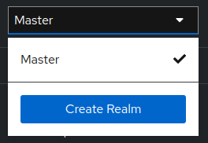

# marcapagina

### Em andamento

API para registro e acompanhamento de evolução de leitura. 
Utiliza o Keycloak para autenticação e autorização.

### Para rodar localmente

#### Configurando Keycloak

**CUIDADO!** Os secrets da aplicação estão no [docker-compose.yml](docker-compose.yaml), que está sendo utilizado
para facilitar o desenvolvimento, porém, para fins de produção, os secrets 
nunca devem ser colocados em um repositorio.

1. Suba o SQL Server e o Keycloak com o comando `docker-compose up`. 
Este comando irá iniciar e configurar o banco de dados,
inicializar o schema, que pode ser visto em [schema.sql](src/main/resources/sql/schema.sql)
e também configurar o Keycloak.
2. Acesse o painel do Keycloak em http://localhost:8080/auth/admin. 
Login e senha são `admin`, de acordo com o definido no [docker-compose.yml](docker-compose.yaml).
3. Deve-se criar o realm e client-id no painel do Keycloak. 
   - Acesse http://localhost:8080/auth/admin login e senha é admin.
   - No combo à esquerda clique em **Create Realm**.
   
   
   - Digite o nome do realm (no nosso caso coloquei `marca-pagina`) e clique em **Create**.
   - No menu lateral clique em **Clients**, depois, **Create Client**. Digite o Client ID (no nosso caso será `login-app`) clique em **Next** e **Save**.
   - Em **Clients Details**, adicione a URL http://localhost:8081/* em **Valid redirect URIs** para permitir o redirect para a api do marcapagina e clique em **Save**.
   - Você pode permitir a criação de um novo usuário no menu lateral em **Realm Settings**, aba **Login**, ative o **User registration**. 
4. A configuração é mantida se o container for parado e iniciado novamente.

#### Rodando aplicação
1. Definir a variável de ambiente DB_SENHA_MARCAPAGINA. A senha do banco encontra-se no [docker-compose.yml](docker-compose.yaml).
2. Rodar direto da IDE a classe `MarcapaginaApplication`, lembrando de informar o profile para a jvm com `-Dspring.profiles.active=dev`. 
Se estiver utilizando o IntelliJ, inclua o comando em `Add VM options` na configuração de Run/Debug.
3. (Alternativa) `mvn spring-boot:run -Drun.profiles=dev`.

#### Cadastrando um livro
Um livro pode ser cadastrado na URL http://localhost:8081/api/cadastrar-livro utilizando o método HTTP `POST`.
Verifique o corpo necessário para salvar o livro em [LivroDTO](src/main/java/com/marcapagina/adaptadores/controladores/dto/LivroDTO.java) e
obtenha o token antes de submeter o cadastro do livro.
> *Obs.:* A capa do livro deve ser enviada em base64.

#### Autenticação

1. Utilizando o Postman, acesse a aba Authorization.
2. Em Grant Type selecione Authorization Code (With PKCE)
3. Callback URL -> http://localhost:8081
4. Auth URL -> http://localhost:8080/auth/realms/marca-pagina/protocol/openid-connect/auth
5. Access Token URL -> http://localhost:8080/auth/realms/marca-pagina/protocol/openid-connect/token
6. Client ID -> login-app
7. Clique em Get New Access Token e informe o login e senha, após clique em Use Token.

